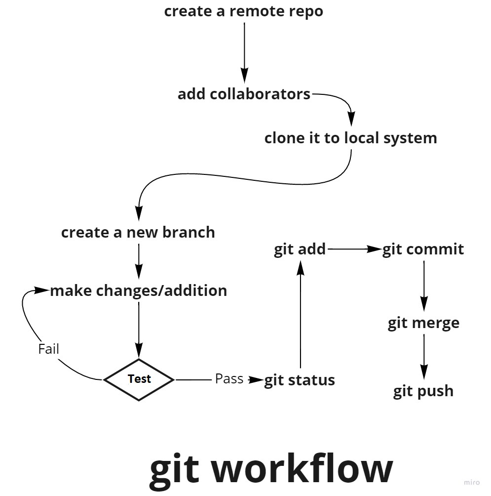

# git

</br>

## git

* git is an acronym for Global information Tracker.
* It is an open-source distributed version control system,
  extensively used by individuals and industries to keep track of the development lifecycle of the product.

* It keeps track of all the changes committed to the project
  across the time, and ensures data integrity.
* As git is a distributed system, it gives developers the power to
  collaborate and work on the same project simultaneously with
  thousands of branches distributed across different systems.

</br>

## Local git client and remote git server

Like all other distributed system git also have two components

* git client running on the local machine, and  
   >This is where a developer does his/her part on project and
    pushes it to the remote server.
* A git server running on cloud or local server  
   > This is the place where code pushed by all the collaborated
    developers in the intended branch.  
    Github and Gitlab are few examples of git hosting websites

</br>

## Head and Branch

### Head

* Ahead is a **pointer that points out to most recent commit in the current checkout branch**.
* On changing branch head also changes.

### Branch

* A branch is a copy of the current checkout branch which includes everything of the current branch till the most recent commit or HEAD.
* Branches allow collaborated developers to make a branch of main/master and work separately on it without affecting the main branch's content.
* Branches are also useful for modular development as changes made to a branch remain to that branch only without affecting main branch content until a merge operation is carried out, ensuring the main remains untouched until the feature is implemented correctly.

</br>

## git commands

</br>

* To set up git global user profile  

  ```bash
    $ git config --global user.name "Your name here"
  ```  

  ```bash
    $ git config --global user.email "your_email@example.com"
  ```


* To generate ssh key  
  
  ```bash
  $ ssh-keygen -t rsa -C "your_email@example.com"
  ```


* To authenticate your ssh with your Github account  
  
  ```bash
  $ ssh -T git@github.com
  ```


* To initiate git to the working directory  
  
  ```bash
  $ git init .
  ```


* To connect the branch to remote project
  
  ```bash
  $ git remote add origin "project-url"
  ```


* To check working tree status  
  
  ```bash
  $ git status
  ```


* To show changes made to committed content  
  
  ```bash
  $ git show #
  ```


* To show commit record  
  
  ```bash
  $ git log
  ```


* To add a file to the staging area  
  
  ```bash
  $ git add [. or file.name]
  ```


* To commit indexed changes  
  
  ```bash
  $ git commit [. or file.name] -m"message"
  ```


* To push changes to remote branch  
  
  ```bash
  $ git push origin "branch.name"
  ```


* To list branches and see current checkout branch  
 
  ```bash
  $ git branch
  ```


* To create a new branch  
  
  ```bash
  $ git branch "branch.name"
  ```


* To select a branch  
  
  ```bash
  $ git checkout "branch.name"
  ```


* To merge a branch to the current checkout branch  
  
  ```bash
  $ git merge "branch.name"
  ```


* To pull from a specific branch  
  
  ```bash
  $ git pull "remote.name" "branch.name"
  ```


* To clone a repository  
  
  ```bash
  $ git clone "repo.url"
  ```

  
* To take backup of uncommitted changes  
  
  ```bash
  $ git stash
  ```

</br>

## git workflow

