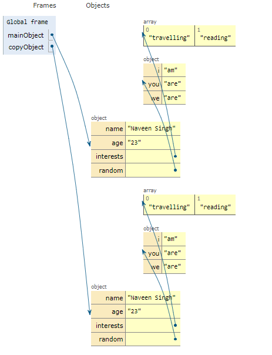

## Object

* An object is a non-primitive data type.
* Object stores data in "key: value" format.
* Objects are copy by reference. i.e. if a variable is initialized with the object it holds the reference to the object, not the object itself.
* Objects can store anything as value.
* Functions stored inside an object as a value are called methods.

### Object creation

```js
//There are multiple ways of creating an object

//1. By using literal notation

const obj = {

};

//2.By using object constructor

const obj = new Object();
```

### Populating an object

```js
    const obj = {

    };

    obj.id = 1;              
    obj.name = "President";

    console.log(obj);//{id: 1, name: "President"}
```

### Accessing object value

```js
const object = {
            fName:"Naveen",
            lName:"Singh",
            age:"23",
            hobby:["Roaming",{gaming:["multiplyer","storyline"]}],
            fullName:function(){
                return this.fName + " " + this.lName;
            }
}
console.log(object.hobby[1].gaming[0]); //"multiplayer"
console.log(object.fullName());  // Naveen Singh
}
```

### Objects methods

1. keys: Returns an array of objects key.

```js
let key = Object.keys({
    key1:"value1",
    key2:"value2",
    key3:"value3",
    key4:"value4",
    key5:"value5"
});
console.log(key);//["key1", "key2", "key3", "key4", "key5"]
```

2. values: Returns an array of objects values.

```js
let value = Object.values({
    key1:"value1",
    key2:"value2",
    key3:"value3",
    key4:"value4",
    key5:"value5"
});
console.log(value);//["value1", "value2", "value3", "value4", "value5"]
```

3. freeze: Prevents change in the object.

```js
let parent ={key1:"value1",
            key2:"value2",
            key3:"value3",
            key4:"value4",
            key5:"value5"
         }
Object.freeze(parent);

parent.notakey="notavalue";
console.log(parent);//{key1: "value1", key2: "value2", key3: "value3", key4: "value4", key5: "value5"}
```

4. assign: Used to create a copy of object,it create copy of only primitive type element but with a little bit attention whole object's copy can be created with this method.

```js
    const mainObject = {
                    name:"Naveen Singh",
                    age:"23",
                    interests:["travelling","reading"],
                    random:{
                      i:"am",
                      you:"are",
                      we:"are"
                      }
                    
                  }                 


const copyObject = Object.assign({},mainObject,{interests:mainObject.interests.map(function(value){return value})},{random:Object.assign({},mainObject.random)}); //complete copy of mainObject
```  


Output:  


## Array

* An array is an object with index as a key.
* Length of an array is lastIndex + 1.

### Array Creation 

```js
//using literal notation
let array = [];  //this is an array

//using array constructor

let array = new Array(2,4,6,7);
```

### Populating an array

```js
let array = [];
array[1] = 5;
array[7] = "blue";
console.log(array.length); //8

```

### Accessing array elements

```js
    const array = [1,2,3,4,["one","two","three"]];
    console.log(array[4][2]);//three
```

### Array methods

1. push: Adds a new element at the end of the array.

```js
    let arr = [];
    arr.push(5);
    arr.push(11);//[5,11]
```

2. pop: Removes the last element of the array.

```js
    let arr = [3,4,5,67,8,9];
    arr.pop();
    arr.pop();
    arr.pop();//[3,4,5]
```


3. unshift: Adds a new element at the start of the array.

```js
    let arr = [3,4,5,67,8,9];
    arr.unshift(2);
    arr.unshift(4);
    arr.unshift(6);
    arr.unshift(8);//[8,6,4,2,3,4,5,67,8,9]
```

4. shift: Removes first element of the array.

```js
let arr = [3,4,5,67,8,9];
    arr.shift();
    arr.shift();
    arr.shift();
    arr.shift();[8,9]
```

5. concat: concatenates two arrays.

```js
    let arr1 = [1,3,5];
    let arr2 = [5,6,8];
    arr1.concat(arr2);//[1,3,5,5,6,8]
```

6. length: returns length of given array. arr_length = last_index + 1


```js
    let arr = [35,6,78,5,9];
    console.log(arr.lrngth);//5
```

7. forEach: Calls a function for each element in the given array.

```js
    let arr = [3,46,8,9,0];
    arr.forEach(function(value,index){
            console.log(value," is at index ",index);
    })
```

8. map: Returns the value of a function for a given array to another array

```js
    let arr = [3,45,6,8,9];
    let newArr = arr.map(function(value){
            return value -11/7;
    });//[1.4285714285714286, 43.42857142857143, 4.428571428571429, 6.428571428571429, 7.428571428571429]
```

9.  filter: Creates a new array for elements of the array that passes the test

```js
    let arr = [3,4,6,9,8,2,4,6,8,5,9,15,17];
    let newArr = arr.filter(function(value){
            if(value % 2 === 0){
                return value;
            }
    });//[4, 6, 8, 2, 4, 6, 8]
```

10. indexOf: If the value is present in the array then returns its index, else returns -1.

```js
let arr = [4,5,6,7,9,0];
console.log(arr.indexOf(5));//1
console.log(arr.indexOf(99));//-1
```

11. join: Make a string out of all elements of the array, accepts separator as an argument

```js
    let arr = ["I","am","still","surviving"];
    console.log(arr.join(" "));//I am still surviving
```

12. isArray: Returns true if given variable is array else returns false.

```js
l   let array = [3,46,6,7,89,5];
    let notArray = "I am not an array,sorry!!";
    console.log(Array.isArray(array));//true
    console.log(Array.isArray(notArray.split("")));//true
```


### spread operator

* Denoted with ... used to create a copy of objects and arrays.
* It Only creates a copy of the primitive type values.
* Can also be used on non-primitive values to create a complete copy of the object.

```js
        const mainObject = {
                    name:"Naveen Singh",
                    age:"23",
                    interests:["travelling","reading"],
                    random:{
                      i:"am",
                      you:"are",
                      we:"are"
                      }                    
                  }
    const copyObject = { ...mainObject, interests:[...mainObject.interests],random:{...mainObject.random} };
    
    console.log(copyObject);  // equivalent to mainObject
    copyObject.random.new = "somethingnew";
     console.log(copyObject);//new:"somethingnew" add in random object
     console.log(mainObject); // remain unaffated
```  

can be used this way also  

```js
    const mainObject = {
                    name:"Naveen Singh",
                    age:"23",
                    interests:["travelling","reading"],
                    random:{
                      i:"am",
                      you:"are",
                      we:"are"
                      }                    
                  }
    let {name,age , ...rest} = mainObject;
    console.log(name,age,rest) //"Naveen Singh" 23 rest contains rest of the object.
```  

can also be passed to function as a parameter  

```js
function spread(...param){   //creates copy on parameter
    name = param.name;
    //etc....
    const mainObject = {
                    name:"Naveen Singh",
                    age:"23",
                    interests:["travelling","reading"],
                    random:{
                      i:"am",
                      you:"are",
                      we:"are"
                      }                    
                  }
    spread(mainObject);
}
```