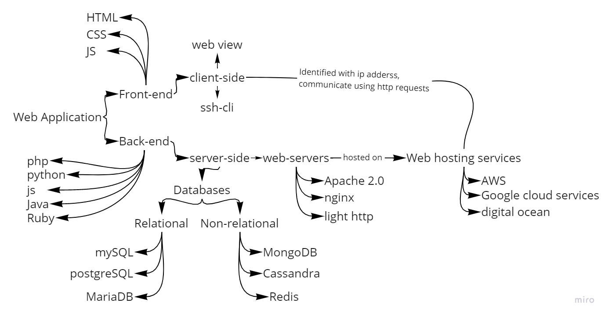

# Basic Building Blocks of Web App Development  

  

## Ip address

Ip addresses are unique ids assigned to devices.  
Ips are nothing but binary values.  
for example: 192.168.0.1 => 11000000.10101000.00000000.00000001 => 32 bit  

* There are two versions of the IP address  
  1. IPv4: 32-bit address => heavily used.  
  2. IPv6: 128-bit address  

## Classification based on the scope  

1. Public IP address: This IP address has global scope. It is used for identifying devices on the web.  
2. Private IP address: This IP address has local scope. It is used for identifying devices within an organisation or on a local network. for example a home wifi router.

## Ip address class  

127 kept reserved for system => localhost

* Class A: 0 - 126 => for large number of hosts
* Class B: 128-191 => for medium sized network
* Class C: 192-223 => for local area network
* Class D: 224-239 => for multicasting /reserved
* Class E: 240-255 => reserved  

## Port

a port is a kind of hosting window on a system through which applications show their presence which can be accessed by IP "address: port"  
for example: while I launch the Minecraft server on my laptop it gets hosted on my localhost and used port 25565.

* 0 - 1023 => reserved port used bt system
* 1024 - 49150 => application port
* 49151 - 65535 => open port  
* port 80 is used for http and port 443 used for https.  

## DNS

DNS stands for Domain Name Service. It stores the name of IP addresses. Which is much easier for humans to remember.
for example: 142.251.36.14 = google.com, but google.com is easier to remember.  

## Software Licences

Software licences are rules under which one chooses to distribute software owned by him the way he/she wants.  
The software can be licenced in two ways  

1. Open Source: The source code of the software is available for free and can be modified.
2. Proprietary  Source code of software remains private and not shared.  

Some licences are listed below:  

1. Apache
2. MIT
3. BSD
4. GPL
5. Mozilla 