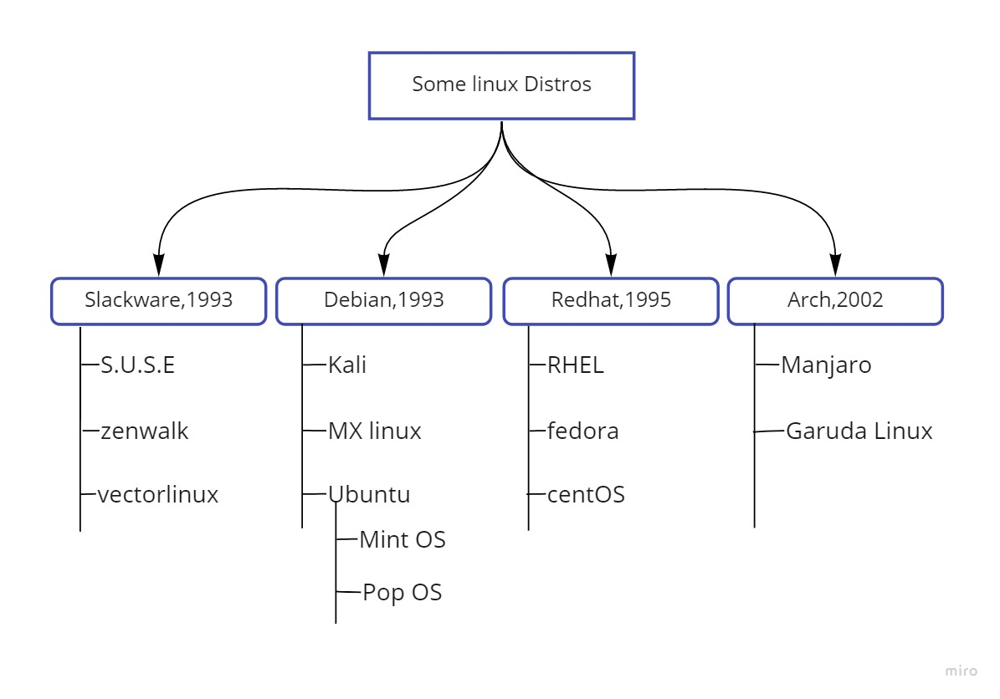

# Linux

### History

* In 1990, Linus Torvalds released **Linux kernel under GNU/GPL**.
* Richard Stallman and Linus started working on Linux operating system and released **GNU Linux in 1991**.
* Linux attracted the attention of hobbyist programmers and the era of free software started in its true sense.

### Kernel

* Kernel is **core** of any operating system.
* It acts as an interface between software and hardware.
* Kernel is responsible for **basic tasks** such as memory management, device management, etc.
* As kernels are responsible for such basic tasks, poorly written kernels can degrade the performance of the device.

### some linux distros



### Linux File System

* Like windows c drive linux file system is location where all mecessary files are stored to make system functional.</br> hierarchy of linux file system is as follows:  
  </br>
  /     => This is root directory  
  /boot => system kernel and boot manager is stored  
  /bin  => user binaries are stored  
  /var  => variable files are stored  
  /mnt  => used to mount media  
  /media=> used to mount removable media  
  /sbin => system level binaries are stored  
  /home => users working directory  
  /usr  => user system resources are stored  
  /temp => used to store temperory files  
  /dev  => contains device informatin  
  /opt  => stores optional software packages  
  /lib  => system files are stored here  
  /etc  => contains configuration files  
  /proc => contains process files  

### Commands

* commands are instructions given to the terminal to execute a specific task.
  
#### Some highly used commands

| Command                                                     | Description                                                                     |
| ----------------------------------------------------------- | ------------------------------------------------------------------------------- |
| ```$ ls```                                                  | Lists content of directory                                                      |
| ```$ ls -l```                                               | Detailed listing                                                                |
| ```$ ls -a```                                               | Lists hidden files also                                                         |
| ```$ ls -t```                                               | Sort w.r.t. time ascending                                                      |
| ```$ ls -r```                                               | Sort w.r.t time descendind                                                      |
| ```$ ls -F```                                               | Classify content type                                                           |
| ```$ pwd```                                                 | Print working directory                                                         |
| ```$ cd "path"```                                           | Change directory                                                                |
| ```$ cd ~``` or ```$ cd```                                  | Switches to home directory                                                      |
| ```$ cd ..```                                               | Changes directory to current directories parent directory                       |
| ```$ cd -```                                                | Switches to recent directory                                                    |
| ```$ cp "source" "destination"```                           | Copies from source to destination                                               |
| ```$ cp "file1"..."fileN" "destination directory"```        | Copies multiple files to destination directory                                  |
| ```$ cp -r "directory" "destination" // -r =>recursive```   | Copies directory to destination directory                                       |
| ```$ mkdir "path/name"```                                   | Creates directory                                                               |
| ```$ mv "argument" "destination"```                         | Moves file                                                                      |
| ```$  rm "file1"..."fileN"```                               | Removes file/s                                                                  |
| ```$ rm -rf "directory"   // -r =>recursive , -f =>force``` | Removes deirectory recursively                                                  |
| ```$ touch "file name"```                                   | Creates file                                                                    |
| ```$ cat "file"```                                          | Prints content of file                                                          |
| ```$ cat > "file"```                                        | Writes/Overwrites file                                                          |
| ```$ cat >> "file"```                                       | Append on bottom of file                                                        |
| ```$ more "file"```                                         | Prints content of file in file 1 page at a time doesn't allow backward movement |
| ```$ less "file"```                                         | Prints content of file in file 1 page at a time allows backward movement        |
| ```$ echo "argument"```                                     | Prints passed argument                                                          |
| ```$ tail "file"```                                         | Shows live change made to a file                                                |
| ```$ man "command"```                                       | Shows manual of command                                                         |
| ```$ who```                                                 | Prints logged in users                                                          |
| ```$ whoami```                                              | Prints current user                                                             |
| ```$ which "package name"```                                | Prints installed path of package                                                |
| ```$ history```                                             | Prints previously used commands                                                 |
| ```$ ping "www.example.com"```                              | Sends and recieves data packets                                                 |
| ```$ ssh user@ip```                                         | Used to connect remotely                                                        |
| ```$ wget "example.com ```                                  | Fethches files                                                                  |
| ```$ exit```                                                | Exits terminal                                                                  |
| ```$ diff "file1" "file2"```                                 | Shows difference between two files                                              |