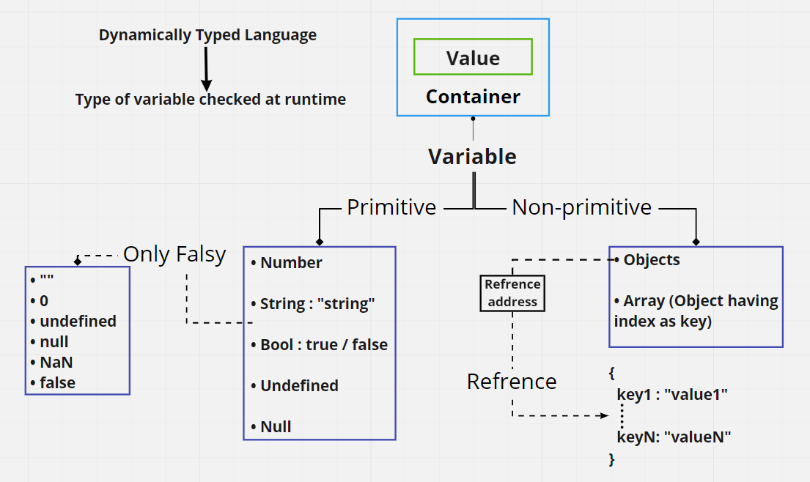
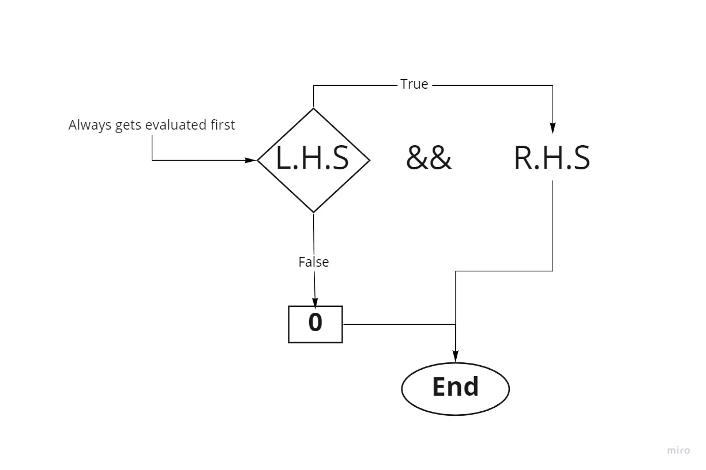
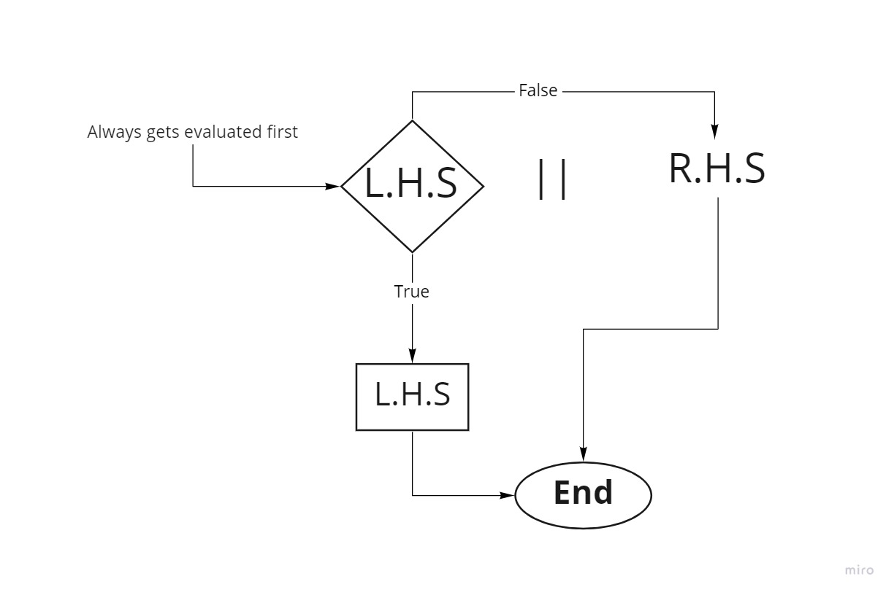
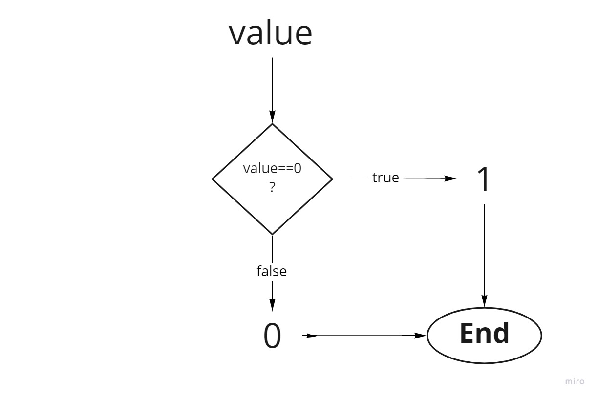

# Variables

  

## Naming rules  

1. first case must be an _alphabate_ or _underscore_.
2. _Keywords_ can't be used as variable names.
3. spacing is not allowed.

## Declarations

| ES5                                          | ES6                                               | ES6                                              |
| -------------------------------------------- | ------------------------------------------------- | ------------------------------------------------ |
| **var**                                      | **let**                                           | **const**                                        |
| It has **FUNCTIONAL SCOPE**                  | It has **BLOCK SCOPE**                            | * It has **BLOCK SCOPE**                         |
| It can be **REASSIGNED** and **REDECLARED**. | It can be reassigned but **can't** be redeclared. | * It **can't be redeclared or reassigned**.      |
| It gets **HOISTED** on top at runtime.       | It doesn't get **HOISTED** on top at runtime.    | * It doesn't get **HOISTED** on top at runtime. |

## Scope

```js
function scope(){
    var ES5;    // can be redeclared hence no error
    outBlock = 22;    // hoisting will happen with var variables on runtime
    console.log(ES5,outBlock);    // undefined 22
    {
        let block = "block scope";
        const constant = true;
        var ES5 = "functional scope";
        let block;    // Uncaught SyntaxError: Identifier 'block' has already been declared
        console.log(block,constant,ES5);    // block scope true functional scope
        constant = false;    // Uncaught TypeError: Assignment to constant variable.
    }
    var outBlock = ES5;
    console.log(outBlock);    // functional scope
    console.log(block);    // Uncaught ReferenceError: block is not defined

}
scope();
```

## Hoisting  

* At runtime ES5 variable declarator var gets at the top of the functional scope, this is called hoisting.
* **Only variable declarations get hoisted not the assignment.**  

 
```js
  //code:            
  function hoist() {
   a = 5;
   {
    console.log(a,b);
   }
   b = 7;
   var a,b;
 }
 hoist();
```  

```js
//runtime:

function hoist() {
    var a,b; //Only declarations get hoisted not initialization
   a = 5;
   {
    console.log(a,b); // output: 5 undefined// 
   }
   b = 7;
 }
 hoist();
```

## Operation  

### Arithmatic  

```js
let Undefined;
let Null = null;
let number = 25;
let string = "string";
let boolean = true;

/*
//Arithmatic
operators like
a +=b 
is equivalent to
a = a + b
*/

//addition/concatanation

/*
<trick>
adding a + in front of any value makes it number type
so the output will be a number(if the number is in form of a string) 
or NaN(for anything other than numbers)
<trick>
*/

  //undefined edition
console.log(Undefined+Null);    // undefined
console.log(Undefined+number);    // NaN
console.log(Undefined+string);    // undefinedstring
console.log(Undefined+boolean)    // NaN

  //string edition: anything + strinng = string
console.log(string+Null);    // stringnull
console.log(string+number);    // string25
console.log(string+boolean);    // stringtrue

  //number edition:simple addition(nothing intresting)
 console.log(number+boolean); //26
 

// multiplication,division and substraction

/*
if this operation is carried out with any variable type other than
numbers or boolean then it yields  "NaN"
*/


//unary operator
  //post increment
console.log(number++);//25

/*
This is called post-increment, value got printed first 
then incremented which means if I do 
*/

console.log(number); //26

//it will print a value incremented by 1
//post decrement i.e. number-- will also follow the same rule

  //pre increment 
console.log(++number);//27

//as the name suggests it increment first and then the value 
//get printed.
//pre decrement will also follow the same rule


//Equivalence check operator

/*
== : checks if value.L.H.S = value.R.H.S{
  draback:Do not check data type,
}

!= : checks if value.L.H.S is not= value.R.H.S{
  draback:Do not check data type,
}

=== : strict equality comparision operator{
  checks data type before comparing value
}
*/


{
  let a = "1";
  let b = 1;
  (a == b)?console.log("auto typecast"):console.log("true"); // false
  (a != b)?console.log("true"):console.log("auto typecast"); // false
  (a === b)?console.log("false"):console.log("no auto typecasting/works perfectly"); // no auto typecasting/works perfectly
}

```

### Logical

* AND  
    

* OR  
  

* NOT  
    


```js
console.log(10 && 1);  // 1
console.log(0 && 10);  // 0
console.log(0 || "hello");  // hello
console.log(11 || 100);  // 11
console.log(!"hello");  // false
console.log(!false);  // true
```