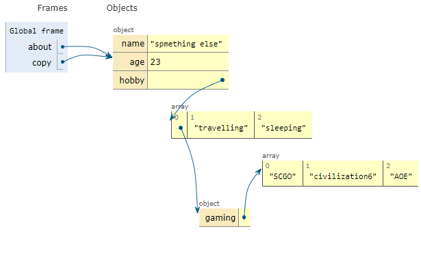

## Copy by value

* Primitive type variable stores actual value at address assigned to them.

```js
    const constant = true; //constant make it evident that primitive variable store actual value in them.
    let v1  = 10; 
    let v2 = v1;  // v2 will make a copy of value stored in variabe v1.
    //i.e. changing value of v2 will not effact value of v1.

    v2 = 20;
    console.log(v2);  // 20
    console.log(v1);  //10
 
```

## Copy by reference  

* Non-primitive variables type such as an object, do not store the object itself, but a reference to object.
* When a variable referencing to an object gets assigned to another variable. It passes a reference to that object.
* It means if the object at referenced location gets altered, it will be visible to every variable referencing it.  
  let's take an example, 

  ```js
    //Game Of reference;
    //This is called pure communist spirit
    //There exist nothing your or mine it's ours
    //changes made by any object reference will reflect throughout all references

    const about = {name:"Naveen",age:23,};   // variable "about" holds holds refrence to object not object itself
    //in simple words variable "about" holds a pointer pointing towards object stored somewhere in memory
    
    const copy = about;  // variable "copy" holds the exact pointer  

    copy.name = "spmething else"; 
    

    about.hobby = ["gaming","travelling","sleeping"];


    copy.hobby[0] = {gaming:["SCGO","civilization6","AOE"]};
  ```

### Outpot

